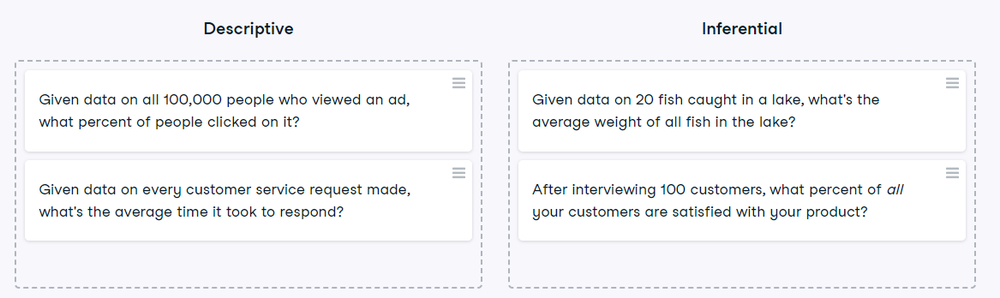

# Descriptive and inferential statistics
Statistics can be used to answer lots of different types of questions, but being able to identify which type of statistics is needed is essential to drawing accurate conclusions. In this exercise, you'll sharpen your skills by identifying which type is needed to answer each question.

### Instructions

Identify which questions can be answered with descriptive statistics and which questions can be answered with inferential statistics.

