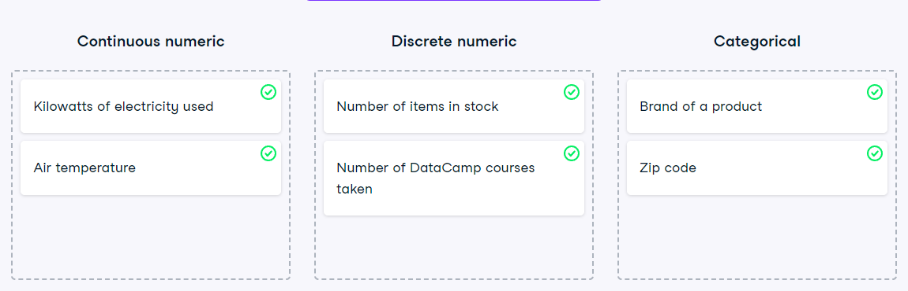

# Data type classification
In the video, you learned about two main types of data: numeric and categorical. Numeric variables can be classified as either discrete or continuous, and categorical variables can be classified as either nominal or ordinal. These characteristics of a variable determine which ways of summarizing your data will work best.

### Instructions

Map each variable to its data type by dragging each item and dropping it into the correct data type.

