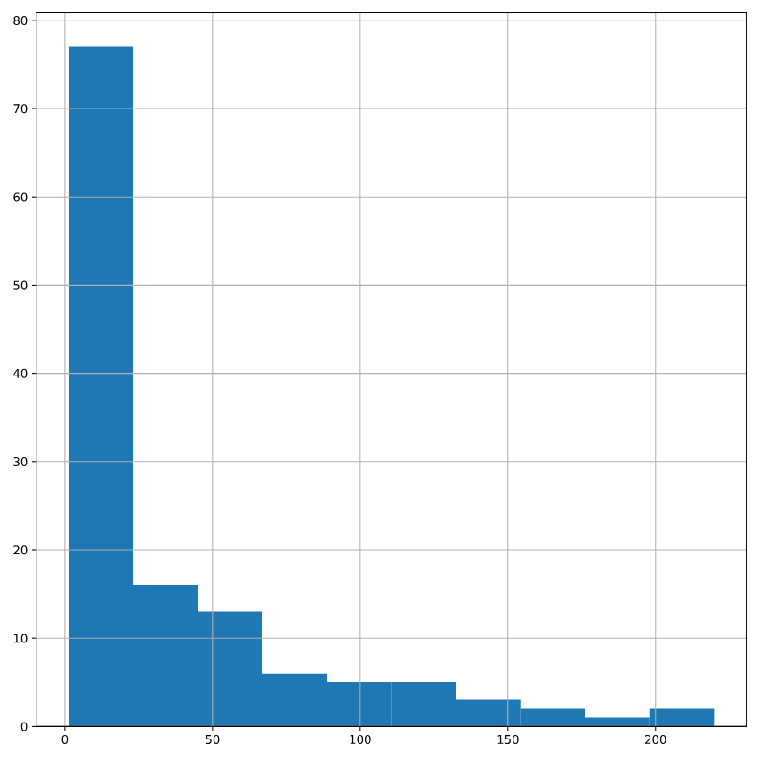

# Mean vs. median
In the video, you learned that the mean is the sum of all the data points divided by the total number of data points, and the median is the middle value of the dataset where 50% of the data is less than the median, and 50% of the data is greater than the median. In this exercise, you'll compare these two measures of center.

pandas is loaded as pd, numpy is loaded as np, and food_consumption is available.

### Instructions 1/4

* Import matplotlib.pyplot with the alias plt.
* Subset food_consumption to get the rows where food_category is 'rice'.
* Create a histogram of co2_emission in rice_consumption DataFrame and show the plot.

#================================================================

``` python
# Import matplotlib.pyplot with alias plt
import matplotlib.pyplot as plt

# Subset for food_category equals rice
rice_consumption = food_consumption[food_consumption['food_category'] == 'rice']

# Histogram of co2_emission for rice and show plot
rice_consumption['co2_emission'].hist()
plt.show()

```

#================================================================



+++++++++++++++++++++++++++++++++++++++++++++++++++++++++++++++++++++++++++++++++++++++

### Instructions 2/4

Question
Take a look at the histogram you just created of different countries' CO2 emissions for rice. Which of the following terms best describes the shape of the data?

Possible answers

* No skew
* Left-skewed
* Right-skewed

Answer : - Right-skewed

+++++++++++++++++++++++++++++++++++++++++++++++++++++++++++++++++++++++++++++++++++++++

### Instructions 3/4

* Use .agg() to calculate the mean and median of co2_emission for rice.

#================================================================

``` python
# Subset for food_category equals rice
rice_consumption = food_consumption[food_consumption['food_category'] == 'rice']

# Calculate mean and median of co2_emission with .agg()
print(rice_consumption.agg([np.mean, np.median]))

```

#================================================================

        Unnamed: 0  consumption  co2_emission
mean         718.5       29.375        37.592
median       718.5       11.875        15.200


++++++++++++++++++++++++++++++++++++++++++++++++++++++++++++++++++++++++++++++++++++++


### Instructions 4/4
Question
Given the skew of this data, what measure of central tendency best summarizes the kilograms of CO2 emissions per person per year for rice?

Possible answers


* Mean
* Median
* Both mean and median

Answer:- Median