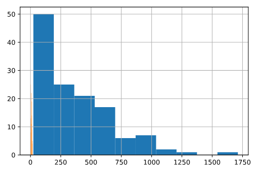

# Variance and standard deviation
Variance and standard deviation are two of the most common ways to measure the spread of a variable, and you'll practice calculating these in this exercise. Spread is important since it can help inform expectations. For example, if a salesperson sells a mean of 20 products a day, but has a standard deviation of 10 products, there will probably be days where they sell 40 products, but also days where they only sell one or two. Information like this is important, especially when making predictions.

pandas has been imported as pd, numpy as np, and matplotlib.pyplot as plt; the food_consumption DataFrame is also available.

### Instructions

* Calculate the variance and standard deviation of co2_emission for each food_category with the .groupby() and .agg() methods; compare the values of variance and standard deviation.
* Create a histogram of co2_emission for the beef in food_category and show the plot.
* Create a histogram of co2_emission for the eggs in food_category and show the plot.

#================================================================


``` python
# Print variance and sd of co2_emission for each food_category
print(food_consumption.groupby('food_category')['co2_emission'].agg([np.var, np.std]))

# Create histogram of co2_emission for food_category 'beef'
food_consumption[food_consumption['food_category'] == 'beef']['co2_emission'].hist()
plt.show()

# Create histogram of co2_emission for food_category 'eggs'
food_consumption[food_consumption['food_category'] == 'eggs']['co2_emission'].hist()
plt.show()

```

Answer:================================================================================

output:
                         var      std
    food_category                    
    beef           88748.408  297.907
    dairy          17671.892  132.936
    eggs              21.372    4.623
    fish             921.637   30.358
    lamb_goat      16475.518  128.357
    nuts              35.640    5.970
    pork            3094.964   55.632
    poultry          245.027   15.653
    rice            2281.376   47.764
    soybeans           0.880    0.938
    wheat             71.024    8.428



