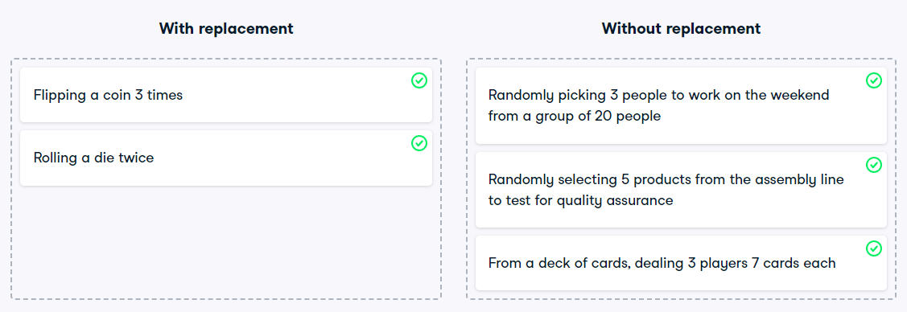

# With or without replacement?
In the video, you learned about two different ways of taking samples: with replacement and without replacement. Although it isn't always easy to tell which best fits various situations, it's important to correctly identify this so that any probabilities you report are accurate. In this exercise, you'll put your new knowledge to the test and practice figuring this out.

### Instructions

For each scenario, decide whether it's sampling with replacement or sampling without replacement.

