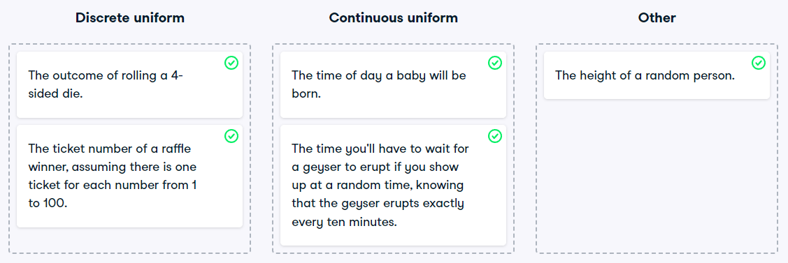

# Which distribution?
At this point, you've learned about the two different variants of the uniform distribution: the discrete uniform distribution, and the continuous uniform distribution. In this exercise, you'll decide which situations follow which distribution.

Illustration of discrete and continuous uniform distributions

### Instructions

* Map each situation to the probability distribution it would best be modeled by.

