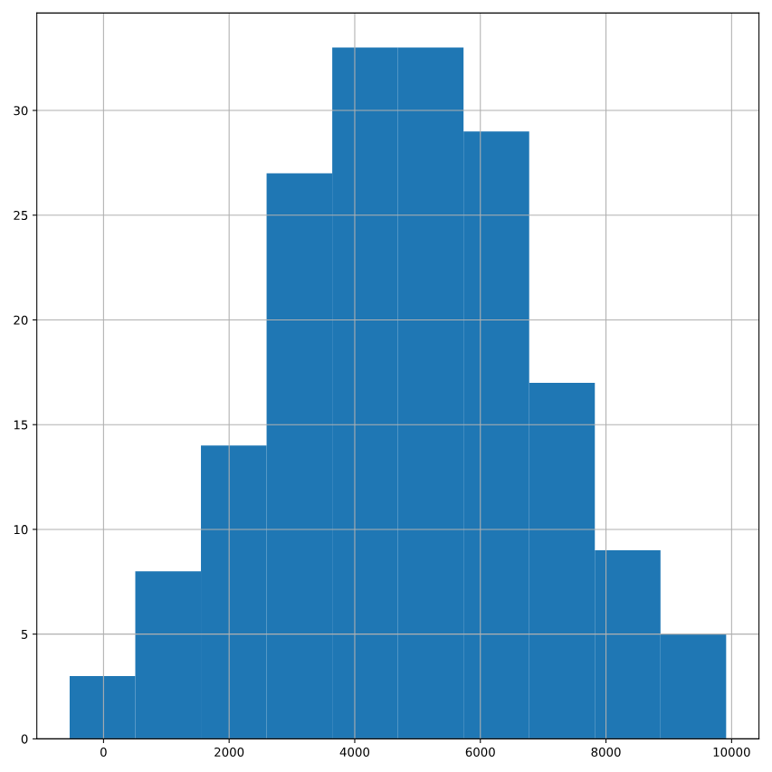

# Distribution of Amir's sales

Since each deal Amir worked on (both won and lost) was different, each was worth a different amount of money. These values are stored in the amount column of amir_deals As part of Amir's performance review, you want to be able to estimate the probability of him selling different amounts, but before you can do this, you'll need to determine what kind of distribution the amount variable follows.

Both pandas as pd and matplotlib.pyplot as plt are loaded and amir_deals is available.

### Instructions 1/2

Create a histogram with 10 bins to visualize the distribution of the amount. Show the plot.

``` python
# Histogram of amount with 10 bins and show plot
amir_deals['amount'].hist(bins=10)
plt.show()

```



### Instructions 2/2

Which probability distribution do the sales amounts most closely follow?

Possible answers


* Uniform
* Binomial
* Normal
* None of the above

``` output
Normal

```