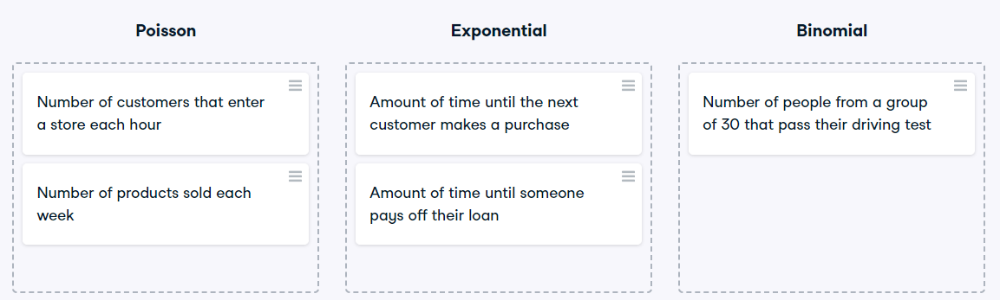

# Distribution dragging and dropping
By this point, you've learned about so many different probability distributions that it can be difficult to remember which is which. In this exercise, you'll practice distinguishing between distributions and identifying the distribution that best matches different scenarios.

### Instructions

* Match each situation to the distribution that best models it.

