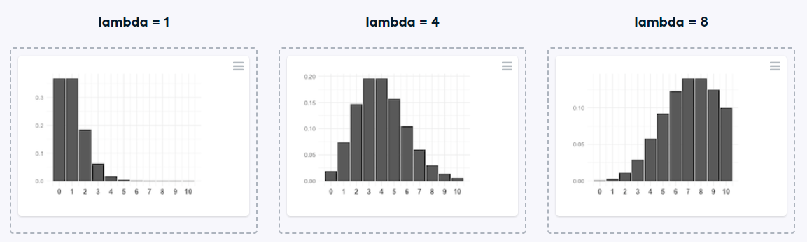

# Identifying lambda
Now that you've learned about the Poisson distribution, you know that its shape is described by a value called lambda. In this exercise, you'll match histograms to lambda values.

### Instructions

* Match each Poisson distribution to its lambda value.

