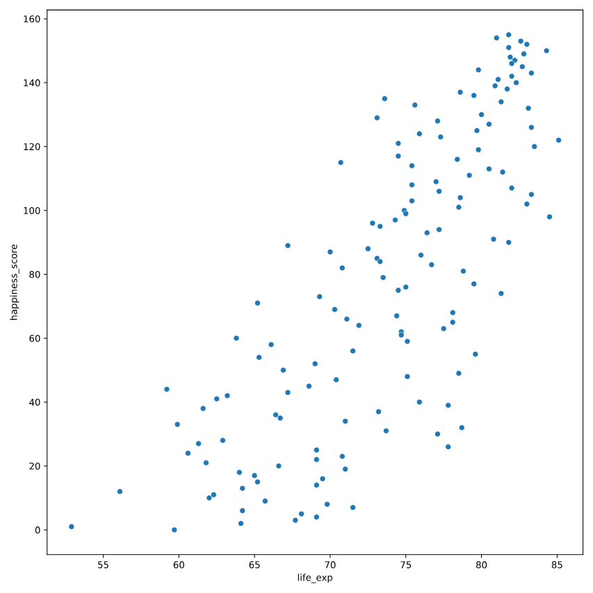

# Relationships between variables
In this chapter, you'll be working with a dataset world_happiness containing results from the 2019 World Happiness Report. The report scores various countries based on how happy people in that country are. It also ranks each country on various societal aspects such as social support, freedom, corruption, and others. The dataset also includes the GDP per capita and life expectancy for each country.

In this exercise, you'll examine the relationship between a country's life expectancy (life_exp) and happiness score (happiness_score) both visually and quantitatively. seaborn as sns, matplotlib.pyplot as plt, and pandas as pd are loaded and world_happiness is available.

### Instructions 1/4

* Create a scatterplot of happiness_score vs. life_exp (without a trendline) using seaborn.
* Show the plot.

``` python
# Create a scatterplot of happiness_score vs. life_exp and show
sns.scatterplot(x='life_exp', y='happiness_score', data=world_happiness)

# Show plot
plt.show()

```



### Instructions 2/4

* Create a scatterplot of happiness_score vs. life_exp with a linear trendline using seaborn, setting ci to None.
* Show the plot.

``` python
# Create scatterplot of happiness_score vs life_exp with trendline
sns.lmplot(x='life_exp', y='happiness_score', data=world_happiness, ci=None)

# Show plot
plt.show()

```


### Instructions 3/4

Question
Based on the scatterplot, which is most likely the correlation between life_exp and happiness_score?

Possible answers


* 0.3
* -0.3
* 0.8
* -0.8
 

``` pythonoutput
0.8

```


### Instructions 4/4

* Calculate the correlation between life_exp and happiness_score. Save this as cor.

``` python
# Create scatterplot of happiness_score vs life_exp with trendline
sns.lmplot(x='life_exp', y='happiness_score', data=world_happiness, ci=None)

# Show plot
plt.show()

# Correlation between life_exp and happiness_score
cor = world_happiness['life_exp'].corr(world_happiness['happiness_score'])

print(cor)

```

``` output
 output:
    0.7802249053272062

```

