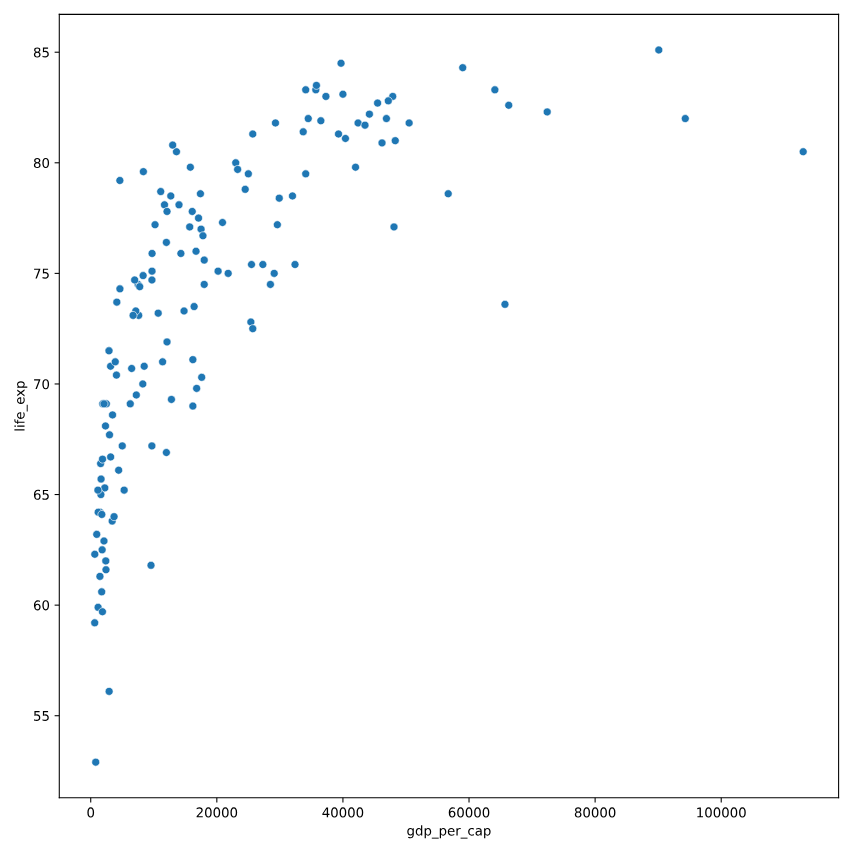

# What can't correlation measure?
While the correlation coefficient is a convenient way to quantify the strength of a relationship between two variables, it's far from perfect. In this exercise, you'll explore one of the caveats of the correlation coefficient by examining the relationship between a country's GDP per capita (gdp_per_cap) and happiness score.

pandas as pd, matplotlib.pyplot as plt, and seaborn as sns are imported, and world_happiness is loaded.

### Instructions 1/3

* Create a seaborn scatterplot (without a trendline) showing the relationship between gdp_per_cap (on the x-axis) and life_exp (on the y-axis).
* Show the plot

``` python
# Scatterplot of gdp_per_cap and life_exp
sns.scatterplot(x='gdp_per_cap', y='life_exp', data=world_happiness)

# Show plot
plt.show()

```



## Instructions 2/3

* Calculate the correlation between gdp_per_cap and life_exp and store as cor.

``` python
# Scatterplot of gdp_per_cap and life_exp
sns.scatterplot(x='gdp_per_cap', y='life_exp', data=world_happiness)

# Show plot
plt.show()
  
# Correlation between gdp_per_cap and life_exp
cor = world_happiness['gdp_per_cap'].corr(world_happiness['life_exp'])

print(cor)

```


## Instructions 3/3

* Question
The correlation between GDP per capita and life expectancy is 0.7. Why is correlation not the best way to measure the relationship between these two variables?

Possible answers


* Correlation measures how one variable affects another.
* Correlation only measures linear relationships.
* Correlation cannot properly measure relationships between numeric variables.

``` output
Correlation only measures linear relationships.

```