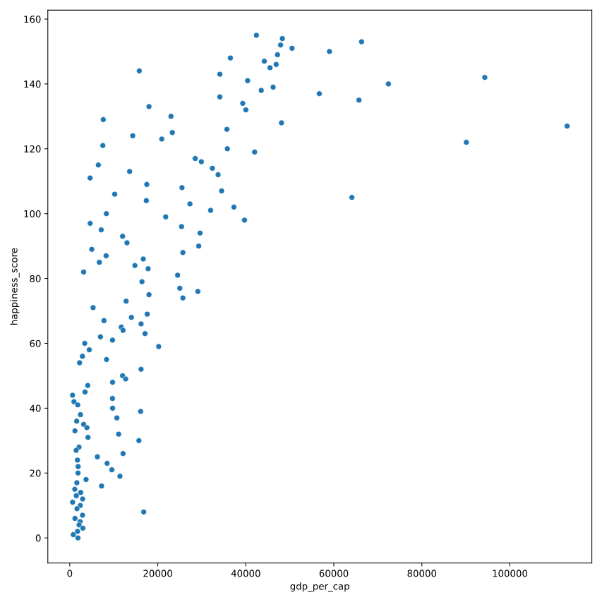
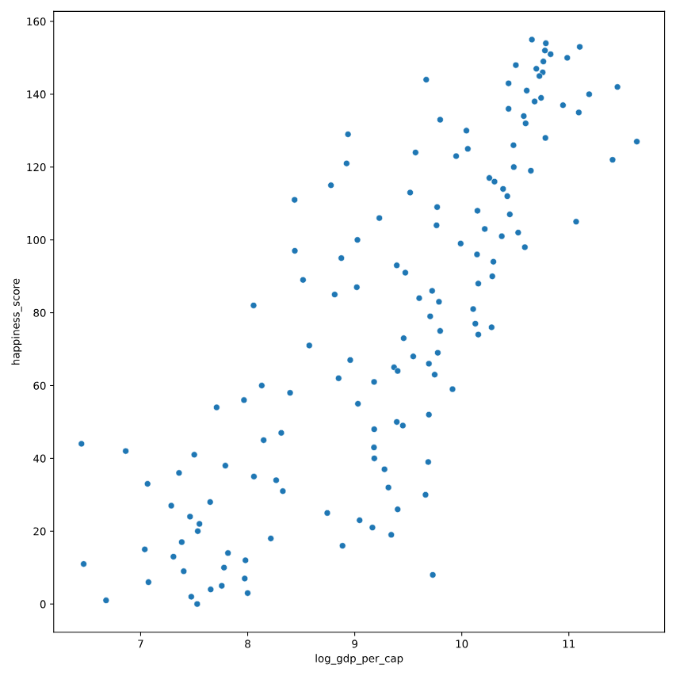

# Transforming variables
When variables have skewed distributions, they often require a transformation in order to form a linear relationship with another variable so that correlation can be computed. In this exercise, you'll perform a transformation yourself.

pandas as pd, numpy as np, matplotlib.pyplot as plt, and seaborn as sns are imported, and world_happiness is loaded.

### Instructions 1/2

* Create a scatterplot of happiness_score versus gdp_per_cap and calculate the correlation between them.

``` python
# Scatterplot of happiness_score vs. gdp_per_cap
sns.scatterplot(x='gdp_per_cap', y='happiness_score', data=world_happiness)
plt.show()

# Calculate correlation
cor = world_happiness['gdp_per_cap'].corr(world_happiness['happiness_score'])
print(cor)

```

``` output
output:
    0.727973301222298

```



### Instructions 2/2 

* Add a new column to world_happiness called log_gdp_per_cap that contains the log of gdp_per_cap.
* Create a seaborn scatterplot of happiness_score versus log_gdp_per_cap.
* Calculate the correlation between log_gdp_per_cap and happiness_score.

``` python
# Create log_gdp_per_cap column
world_happiness['log_gdp_per_cap'] = np.log(world_happiness['gdp_per_cap'])

# Scatterplot of happiness_score vs. log_gdp_per_cap
sns.scatterplot(x='log_gdp_per_cap', y='happiness_score', data=world_happiness)
plt.show()

# Calculate correlation
cor = world_happiness['log_gdp_per_cap'].corr(world_happiness['happiness_score'])
print(cor)

```

``` output
output:
    0.8043146004918288

```

