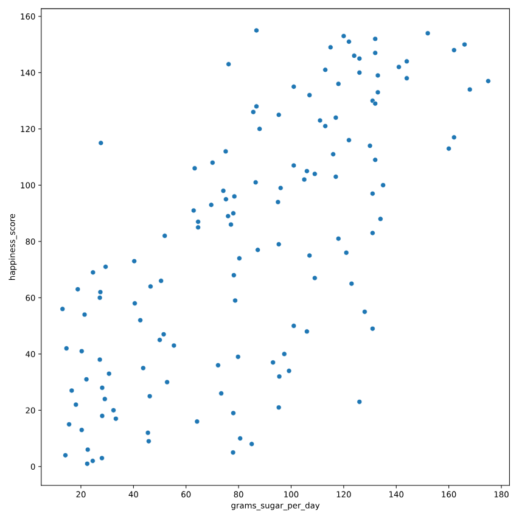

# Does sugar improve happiness?
A new column has been added to world_happiness called grams_sugar_per_day, which contains the average amount of sugar eaten per person per day in each country. In this exercise, you'll examine the effect of a country's average sugar consumption on its happiness score.

pandas as pd, matplotlib.pyplot as plt, and seaborn as sns are imported, and world_happiness is loaded.

### Instructions 1/2

* Create a seaborn scatterplot showing the relationship between grams_sugar_per_day (on the x-axis) and happiness_score (on the y-axis).
* Calculate the correlation between grams_sugar_per_day and happiness_score.

``` python
# Scatterplot of grams_sugar_per_day and happiness_score
sns.scatterplot(x='grams_sugar_per_day', y='happiness_score', data=world_happiness)
plt.show()

# Correlation between grams_sugar_per_day and happiness_score
cor = world_happiness['grams_sugar_per_day'].corr(world_happiness['happiness_score'])
print(cor)

```

``` output
output:
    0.6939100021829633

```



### Instructions 2/2

Question
Based on this data, which statement about sugar consumption and happiness scores is true?

Possible answers


* Increased sugar consumption leads to a higher happiness score.
* Lower sugar consumption results in a lower happiness score
* Increased sugar consumption is associated with a higher happiness score.
* Sugar consumption is not related to happiness.

``` output
Increased sugar consumption is associated with a higher happiness score.

```