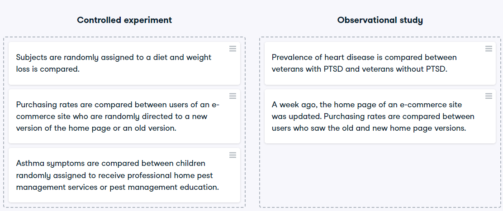

# Study types
While controlled experiments are ideal, many situations and research questions are not conducive to a controlled experiment. In a controlled experiment, causation can likely be inferred if the control and test groups have similar characteristics and don't have any systematic difference between them. On the other hand, causation cannot usually be inferred from observational studies, whose results are often misinterpreted as a result.

In this exercise, you'll practice distinguishing controlled experiments from observational studies.

### Instructions

Determine if each study is a controlled experiment or observational study.

